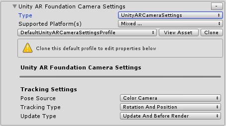

# Unity AR camera settings provider

The Unity AR camera settings provider is an experimental MRTK component that enables mixed reality applications to run on Android and iOS devices.

## Unity AR camera settings provider options

For a guide on how to add the provider to your scene: [How to configure MRTK for iOS and Android](../cross-platform/using-ar-foundation.md)

### Tracking settings

The Unity AR camera settings provider allows configuration options for how tracking is performed. These settings are specific to the Unity AR camera settings provider implementation.

**Pose Source**

The pose source defines the available types of augmented reality tracking poses. In general, these values map to a component of the device on which the application is running.

The available options are described in the following table.

| Option | Description |
| --- | --- |
| Center | The center eye of a head mounted device. |
| Color Camera | The color camera of a mobile device. |
| Head | The head eye of a head mounted device, often slightly above the center eye. |
| Left Eye | The left eye of a head mounted device. |
| Left Pose | The left hand controller pose. |
| Right Eye | The right eye of a head mounted device. |
| Right Pose | The right hand controller pose. |

The default value for pose source is **Color Camera**, to enable a transparent display on mobile devices, such as a phone or tablet.

**Tracking Type**

The tracking type defines the portion(s) of the pose that will be used for tracking.

The available options are described in the following table.

| Option | Description |
| --- | --- |
| Position | The position of the device. |
| Rotation | The rotation of the device. |
| Rotation And Position | The position and rotation of the device. |

The default value for tracking type is **Rotation And Position**, to enable the richest tracking experience.

**Update Type**

The update type defines at what points, during frame processing, the pose data will be sampled.

The available options are described in the following table.

| Option | Description |
| --- | --- |
| Before Render | Just before rendering. |
| Update | During the update phase of the frame. |
| Update And Before Render | During the update phase and just before rendering. |

The default value for tracking type is **Update And Before Render**, to enable the lowest tracking latency.

## See also

- [Camera System Overview](camera-system-overview.md)
- [Creating a Camera Settings Provider](create-settings-provider.md)
