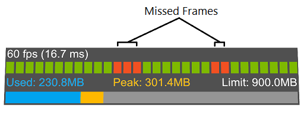

# Using the visual profiler

The VisualProfiler provides an easy to use, in-application view of a mixed reality application's performance. The profiler is supported on all Mixed Reality Toolkit platforms, including:

- Microsoft HoloLens (1st gen)
- Microsoft HoloLens 2
- Windows Mixed Reality immersive headsets
- OpenVR

While developing an application, focus on multiple parts of the scene as the Visual Profiler displays data relative to the current view.

> [!IMPORTANT]
> Focus attention on portions of the scene with complex objects, particle effects or activity. These and other factors often contribute to reduction in application performance and a less than ideal user experience.

## Visual profiler interface

The Visual Profiler interface includes the following components:

- [Frame Rate](#frame-rate)
- [Frame Time](#frame-time)
- [Frame Graph](#frame-graph)
- [Memory Utilization](#memory-utilization)

### Frame rate

In the upper-left corner of the interface is the frame rate, measured in frames per second. For the best user experience and comfort, this value should be as high as possible.

The specific platform and hardware configuration will play a significant role in the maximum achievable frame rate. Some common target values include:

- Microsoft HoloLens: 60
- Windows Mixed Reality Ultra: 90

> [!NOTE]
> Due to [frame rate throttling on HoloLens when default MRC is active](https://docs.microsoft.com/windows/mixed-reality/mixed-reality-capture-for-developers#what-to-expect-when-mrc-is-enabled-on-hololens), the visual profiler hides itself while videos and photos are captured. This setting can be overridden in the diagnostics system profile.

### Frame time

To the right of the frame rate is the frame time, in milliseconds, spent on the CPU. To achieve the target frame rates mentioned previously, an application can spend the following amount of time per frame:

- 60 fps: 16.6 ms
- 90 fps: 11.1 ms

GPU time is planned to be added in a future release.

### Frame graph

The frame graph provides a graphical display of the application frame rate history.

When using the application, look for missed frames which indicate that the application is not hitting its target frame rate and may need optimization work.

### Memory utilization

The memory utilization display allows for easy understanding of how the current view is impacting an application's memory consumption.

When using the application, look for total memory usage. Key indicators include nearing the memory limit and rapid changes in usage.

## Customizing the visual profiler

The Visual Profiler's appearance and behavior are customizable via the diagnostics system profile. Please see [Configuring the Diagnostics System](ConfiguringDiagnostics.md) for more information.

## See also

- [Diagnostics System](DiagnosticsSystemGettingStarted.md)
- [Configuring the Diagnostics System](ConfiguringDiagnostics.md)
