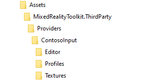
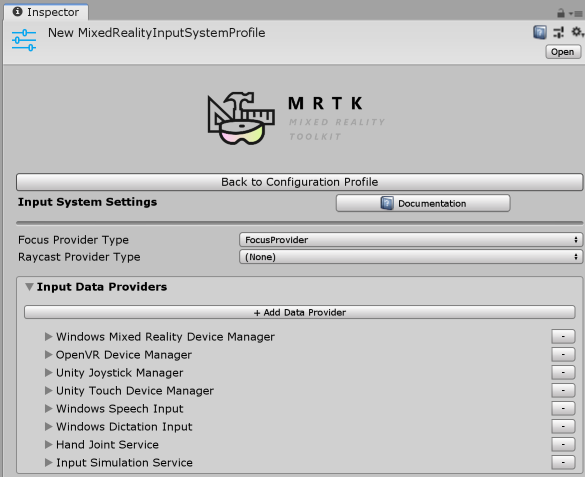

# Creating an input system data provider

The Mixed Reality Toolkit input system is an extensible system for enabling input device support. To add support for a new hardware platform,
a custom input data provider may be required.

This article describes how to create custom data providers, also called device managers, for the input system. The example code shown here is
from the [`WindowsMixedRealityDeviceManager`](xref:Microsoft.MixedReality.Toolkit.WindowsMixedReality.Input.WindowsMixedRealityDeviceManager).

> The complete code used in this example can be found in the MRTK/Providers/WindowsMixedReality folder.

## Namespace and folder structure

Data providers can be distributed as a third party add-on or as a part of the Microsoft Mixed Reality Toolkit. The approval process for submissions of
new data providers to the MRTK will vary on a case-by-case basis and will be communicated at the time of the initial proposal.

> [!Important]
> If an input system data provider is being submitted to the [Mixed Reality Toolkit repository](https://github.com/Microsoft/MixedRealityToolkit-Unity), the
namespace **must** begin with Microsoft.MixedReality.Toolkit (ex: Microsoft.MixedReality.Toolkit.WindowsMixedReality) and the code should be
located in a folder beneath MRTK/Providers (ex: MRTK/Providers/WindowsMixedReality).

### Namespace

Data providers are required to have a namespace to mitigate potential name collisions. It is recommended that the namespace includes the following components.

- Company name
- Feature area

For example, an input data provider created by the Contoso company may be "Contoso.MixedReality.Toolkit.Input".

### Recommended folder structure

It is recommended that the source code for data providers be layed out in a folder hierarchy as shown in the following image.



Where ContosoInput contains the implementation of the data provider, the Editor folder contains the inspector (and any other Unity editor specific code), the Textures folder
contains images of the supported controllers, and Profiles contains one or more pre-made profiles.

> [!Note]
> Some common controller images can be found in the MixedRealityToolkit\StandardAssets\Textures folder.

## Implement the data provider

### Specify interface and/or base class inheritance

All input system data providers must implement the [`IMixedRealityInputDeviceManager`](xref:Microsoft.MixedReality.Toolkit.Input.IMixedRealityInputDeviceManager)
interface, which specifies the minimum functionality required by the input system. The MRTK foundation includes the [`BaseInputDeviceManager`](xref:Microsoft.MixedReality.Toolkit.Input.BaseInputDeviceManager)
class which provides a default implementation of this required functionality. For devices that build upon Unity's UInput class, the [`UnityJoystickManager`](xref:Microsoft.MixedReality.Toolkit.Input.UnityInput.UnityJoystickManager)
class can be used as a base class.

> [!Note]
> The `BaseInputDeviceManager` and `UnityJoystickManager` classes provide the required `IMixedRealityInputDeviceManager` implementation.

```c#
public class WindowsMixedRealityDeviceManager :
    BaseInputDeviceManager,
    IMixedRealityCapabilityCheck
{ }
```

> `IMixedRealityCapabilityCheck` is used by the `WindowsMixedRealityDeviceManager` to indicate that it provides support for a set of input capabilities, specifically; articulated hands,
gaze-gesture-voice hands and motion controllers.

#### Apply the MixedRealityDataProvider attribute

A key step of creating an input system data provider is to apply the [`MixedRealityDataProvider`](xref:Microsoft.MixedReality.Toolkit.MixedRealityDataProviderAttribute)
attribute to the class. This step enables setting the default profile and platform(s) for the provider, when selected in the input system profile.

```c#
[MixedRealityDataProvider(
    typeof(IMixedRealityInputSystem),
    SupportedPlatforms.WindowsUniversal,
    "Windows Mixed Reality Device Manager")]
public class WindowsMixedRealityDeviceManager :
    BaseInputDeviceManager,
    IMixedRealityCapabilityCheck
{ }
```

### Implement the IMixedRealityDataProvider methods

Once the class has been defined, the next step is to provide the implementation of the [`IMixedRealityDataProvider`](xref:Microsoft.MixedReality.Toolkit.IMixedRealityDataProvider)
interface.

> [!Note]
> The `BaseInputDeviceManager` class, via the `BaseService` class, provides only empty implementations for `IMixedRealityDataProvider` methods. The details of these methods are generally data provider specific.

The methods that should be implemented by the data provider are:

- `Destroy()`
- `Disable()`
- `Enable()`
- `Initialize()`
- `Reset()`
- `Update()`

### Implement the data provider logic

The next step is to add the logic for managing the input devices, including any controllers to be supported.

### Implement the controller classes

 The example of the `WindowsMixedRealityDeviceManager` defines and implements the following controller classes.

> The source code for each of these classes can be found in the MRTK/Providers/WindowsMixedReality folder.

- WindowsMixedRealityArticulatedHand.cs
- WindowsMixedRealityController.cs
- WindowsMixedRealityGGVHand.cs

> [!Note]
> Not all device managers will support multiple controller types.

#### Apply the MixedRealityController attribute

Next, apply the [`MixedRealityController`](xref:Microsoft.MixedReality.Toolkit.Input.MixedRealityControllerAttribute) attribute to the class. This attribute specifies the type of controller
(ex: articulated hand), the handedness (ex: left or right) and an optional controller image.

```c#
[MixedRealityController(
    SupportedControllerType.WindowsMixedReality,
    new[] { Handedness.Left, Handedness.Right },
    "StandardAssets/Textures/MotionController")]
{ }
```

#### Configure the interaction mappings

The next step is to define the set of interaction mappings supported by the controller. For devices that receive their data via Unity's Input class, the [controller mapping tool](../tools/controller-mapping-tool.md) is a helpful resource to confirm the correct axis and button mappings to assign to interactions.

The following example is abbreviated from the `GenericOpenVRController` class, located in the MRTK/Providers/OpenVR folder.

```c#
public override MixedRealityInteractionMapping[] DefaultLeftHandedInteractions => new[]
{
    // Controller Pose
    new MixedRealityInteractionMapping(0, "Spatial Pointer", AxisType.SixDof, DeviceInputType.SpatialPointer, MixedRealityInputAction.None),
    // Left Trigger Squeeze
    new MixedRealityInteractionMapping(1, "Trigger Position", AxisType.SingleAxis, DeviceInputType.Trigger, ControllerMappingLibrary.AXIS_9),
    // Left Trigger Press (Select)
    new MixedRealityInteractionMapping(2, "Trigger Press (Select)", AxisType.Digital, DeviceInputType.TriggerPress, KeyCode.JoystickButton14),
};
```

>[!Note]
>The [`ControllerMappingLibrary`](xref:Microsoft.MixedReality.Toolkit.Input.ControllerMappingLibrary) class provides symbolic constants for the Unity input axis and button definitions.

### Raise notification events

To enable applications to respond to input from the user, the data provider raises notification events corresponding to controller state changes as defined in
the [`IMixedRealityInputHandler`](xref:Microsoft.MixedReality.Toolkit.Input.IMixedRealityInputHandler) and [`IMixedRealityInputHandler<T>`](xref:Microsoft.MixedReality.Toolkit.Input.IMixedRealityInputHandler`1) interfaces.

For digital (button) type controls, raise the OnInputDown and OnInputUp events.

```c#
// inputAction is the input event that is to be raised.
if (interactionSourceState.touchpadPressed)
{
    InputSystem?.RaiseOnInputDown(InputSource, ControllerHandedness, inputAction);
}
else
{
    InputSystem?.RaiseOnInputUp(InputSource, ControllerHandedness, inputAction);
}
```

For analog controls (ex: touchpad position) the InputChanged event should be raised.

```c#
InputSystem?.RaisePositionInputChanged(InputSource, ControllerHandedness, interactionMapping.MixedRealityInputAction, interactionSourceState.touchpadPosition);
```

### Add Unity Profiler instrumentation

Performance is critical in mixed reality applications. Every component adds some amount of overhead for which applications must account. To this end, it is important that all input data providers contain Unity Profiler instrumentation in inner loop and frequently utilized code paths.

It is recommended to implement the pattern utilized by the MRTK when instrumenting custom providers.

```c#
        private static readonly ProfilerMarker GetOrAddControllerPerfMarker = new ProfilerMarker("[MRTK] WindowsMixedRealityDeviceManager.GetOrAddController");

        private async void GetOrAddController(InteractionSourceState interactionSourceState)
        {
            using (GetOrAddControllerPerfMarker.Auto())
            {
                // Code to be measured.
            }
        }
```

> [!Note]
> The name used to identify the profiler marker is arbitrary. The MRTK uses the following pattern.
>
> "[product] className.methodName - optional note"
>
> It is recommended that custom data providers follow a similar pattern to help simplify identification of specific components and methods when analyzing traces.

## Create the profile and inspector

In the Mixed Reality Toolkit, data providers are configured using [profiles](../profiles/profiles.md).

Data providers with additional configuration options (ex: [InputSimulationService](../input-simulation/input-simulation-service.md)) should create a profile and inspector to allow
customers to modify the behavior to best suit the needs of the application.

> The complete code for the example in this section can be found in the MRTK.Services/InputSimulation folder.

### Define the profile

Profile contents should mirror the accessible properties of the observer (ex: update interval). All of the user configurable properties defined in each
interface should be contained with the profile.

```c#
[CreateAssetMenu(
    menuName = "Mixed Reality Toolkit/Profiles/Mixed Reality Simulated Input Profile",
    fileName = "MixedRealityInputSimulationProfile",
    order = (int)CreateProfileMenuItemIndices.InputSimulation)]
public class MixedRealityInputSimulationProfile : BaseMixedRealityProfile
{ }
```

The `CreateAssetMenu` attribute can be applied to the profile class to enable customers to create a profile instance using the
**Create > Assets > Mixed Reality Toolkit > Profiles** menu.

### Implement the inspector

Profile inspectors are the user interface for configuring and viewing profile contents. Each profile inspector should extend the
[`BaseMixedRealityToolkitConfigurationProfileInspector](xref:Microsoft.MixedReality.Toolkit.Editor.BaseMixedRealityToolkitConfigurationProfileInspector) class.

```c#
[CustomEditor(typeof(MixedRealityInputSimulationProfile))]
public class MixedRealityInputSimulationProfileInspector : BaseMixedRealityToolkitConfigurationProfileInspector
{ }
```

The `CustomEditor` attribute informs Unity the type of asset to which the inspector applies.

## Create assembly definition(s)

The Mixed Reality Toolkit uses assembly definition ([.asmdef](https://docs.unity3d.com/Manual/ScriptCompilationAssemblyDefinitionFiles.html)) files to specify dependencies
between components as well as to assist Unity in reducing compilation time.

It is recommended that assembly definition files are created for all data providers and their editor components.

Using the [folder structure](#recommended-folder-structure) in the earlier example, there would be two .asmdef files for the ContosoInput data provider.

The first assembly definition is for the data provider. For this example, it will be called ContosoInput and will be located in the example's ContosoInput folder.
This assembly definition must specify a dependency on Microsoft.MixedReality.Toolkit and any other assemblies upon which it depends.

The ContosoInputEditor assembly definition will specify the profile inspector and any editor specific code. This file must be located in the root folder of the editor code. In this example,
the file will be located in the ContosoInput\Editor folder. This assembly definition will contain a reference to the ContosoInput assembly as well as:

- Microsoft.MixedReality.Toolkit
- Microsoft.MixedReality.Toolkit.Editor.Inspectors
- Microsoft.MixedReality.Toolkit.Editor.Utilities

## Register the data provider

Once created, the data provider can be registered with the input system and be used in the application.



## Packaging and distribution

Data providers that are distributed as third party components have the specific details of packaging and distribution left to the preference of the developer. Likely, the most
common solution will be to generate a .unitypackage and distribute via the Unity Asset Store.

If a data provider is submitted and accepted as a part of the Microsoft Mixed Reality Toolkit package, the Microsoft MRTK team will package and distribute it as part of the MRTK offerings.

## See also

- [Input system](overview.md)
- [`BaseInputDeviceManager` class](xref:Microsoft.MixedReality.Toolkit.Input.BaseInputDeviceManager)
- [`IMixedRealityInputDeviceManager` interface](xref:Microsoft.MixedReality.Toolkit.Input.IMixedRealityInputDeviceManager)
- [`IMixedRealityInputHandler` interface](xref:Microsoft.MixedReality.Toolkit.Input.IMixedRealityInputHandler)
- [`IMixedRealityInputHandler<T>` interface](xref:Microsoft.MixedReality.Toolkit.Input.IMixedRealityInputHandler`1)
- [`IMixedRealityDataProvider` interface](xref:Microsoft.MixedReality.Toolkit.IMixedRealityDataProvider)
- [`IMixedRealityCapabilityCheck` interface](xref:Microsoft.MixedReality.Toolkit.IMixedRealityCapabilityCheck)
- [Controller Mapping Tool](../tools/controller-mappingTool.md)
