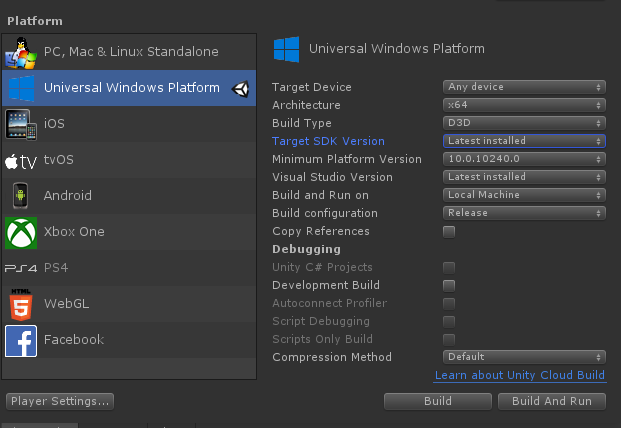
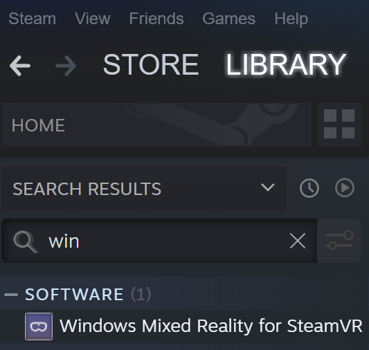
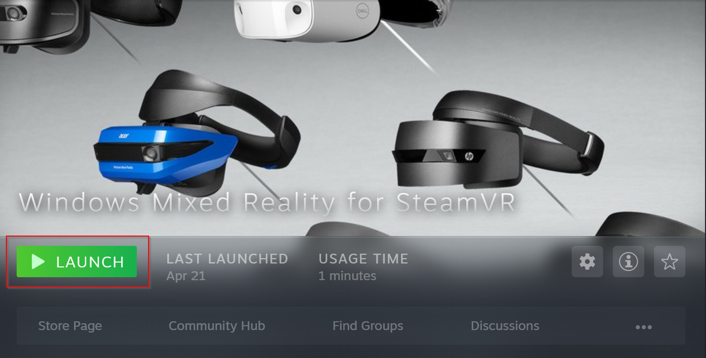
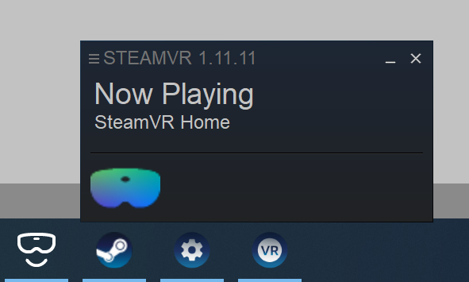
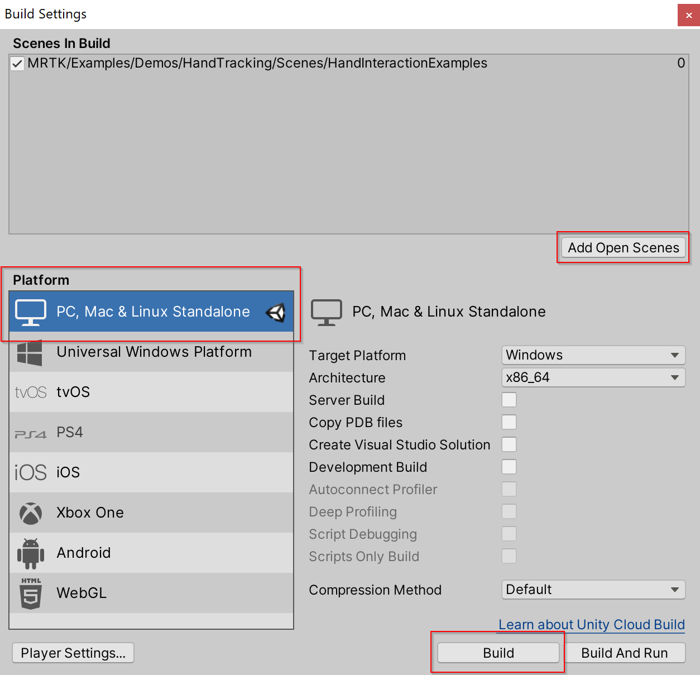

# Building and deploying MRTK

To run an app on device as a standalone app (for HoloLens, Android, iOS, etc.), the build and deploy step needs to be executed in the unity project. Building and deploying an app that uses MRTK is just like building and deploying any other Unity app. There are no MRTK-specific instructions. Read below for detailed steps on how to build and deploy a Unity app for HoloLens.  Learn more about building for other platforms at [Publishing Builds](https://docs.unity3d.com/Manual/PublishingBuilds.html).

## Building and deploying MRTK to HoloLens 1 and HoloLens 2 (UWP)

Instructions on how to build and deploy for HoloLens 1 and HoloLens 2 (UWP) can be found at [building your application to device](https://docs.microsoft.com/windows/mixed-reality/mrlearning-base-ch1#build-your-application-to-your-device).

**Tip:** When building for WMR, HoloLens 1, or HoloLens 2, it is recommended that the build settings "Target SDK Version"
and "Minimum Platform Version" look like they do in the picture below:

The other settings can be different (for example, Build Configuration/Architecture/Build Type and others can always
be changed inside the Visual Studio solution).

Make sure that the "Target SDK Version" dropdown includes the option "10.0.18362.0" - if this is missing,
[the latest Windows SDK](https://developer.microsoft.com/windows/downloads/windows-10-sdk) needs to be installed.

### Unity 2019.3 and HoloLens

If a HoloLens app appears as a 2D panel on device, make sure the following settings have been configured in Unity 2019.3.x before deploying your UWP app:

If using the legacy XR:

1. Navigate to Edit > Project Settings, Player
1. Under **XR Settings** in the UWP tab, make sure **Virtual Reality Supported** is enabled and the **Windows Mixed Reality** SDK has been added to SDKs.
1. Build and deploy in Visual Studio

If using the XR-Plugin:

1. Follow the steps found in [Getting Started with XRSDK](GettingStartedWithMRTKAndXRSDK.md)
1. Make sure the configuration profile is the **DefaultXRSDKConfigurationProfile**
1. Navigate to **Edit > Project Settings, XR-Plugin Management** and make sure **Windows Mixed Reality** is enabled.
1. Build and deploy in Visual Studio

>[!IMPORTANT]
> If using Unity 2019.3.x, select **ARM64** and not **ARM** as the build architecture in Visual Studio. With the default Unity settings in Unity 2019.3.x, a Unity app will not deploy to a HoloLens if ARM is selected due to a Unity bug. This can be tracked on [Unity's issue tracker](https://issuetracker.unity3d.com/issues/enabling-graphics-jobs-in-2019-dot-3-x-results-in-a-crash-or-nothing-rendering-on-hololens-2).
>
> If the ARM architecture is required, navigate to **Edit > Project Settings, Player**, and under the **Other Settings** menu disable **Graphics Jobs**. Disabling **Graphics Jobs** will allow the app to deploy using the ARM build architecture for Unity 2019.3.x, but ARM64 is recommended.

## Building and deploying MRTK to a Windows Mixed Reality Headset

The Windows Mixed Reality (WMR) headset can be used for Universal Windows Platform (UWP) and Standalone builds.  A Standalone build for a WMR headset requires the following extra steps:

> [!NOTE]
> Unity's XR SDK also supports native WMR in Standalone builds, but does not require SteamVR or WMR plugin. These steps are required for Unity's legacy XR.

1. Install [Steam](https://store.steampowered.com/about/)
1. Install [SteamVR](https://store.steampowered.com/app/250820/SteamVR/)
1. Install the [WMR Plugin](https://store.steampowered.com/app/719950/Windows_Mixed_Reality_for_SteamVR/)

### How to use WMR plugin

1. Open Steam and search for the Windows Mixed Reality Plugin
    - Make sure SteamVR is closed before launching the WMR Plugin. Launching the WMR plugin also launches SteamVR.
    - Make sure the WMR headset is plugged in.

    

1. Select **Launch** for the Windows Mixed Reality for SteamVR Plugin.

    

    - SteamVR and the WMR plugin will launch and a new tracking status window for the WMR headset will appear.
    - For more information visit the [Windows Mixed Reality Steam Documentation](https://support.microsoft.com/help/4053622/windows-10-play-steamvr-games-in-windows-mixed-reality)

        

1. In Unity, with your MRTK scene open, navigate to **File > Build Settings**

1. Build the scene
    - Select **Add Open Scene**
    - Make sure the Platform is **Standalone**
    - Select **Build**
    - Choose the location for the new build in File Explorer

    

1. A new Unity executable will be created, to launch your app select the Unity executable in File Explorer.

    

## See also

- [Android and iOS Support](../features/cross-platform/UsingARFoundation.md)
- [Leap Motion Support](../features/cross-platform/LeapMotionMRTK.md)
- [Detecting Platform Capabilities](../features/cross-platform/DetectingPlatformCapabilities.md)
