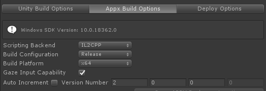
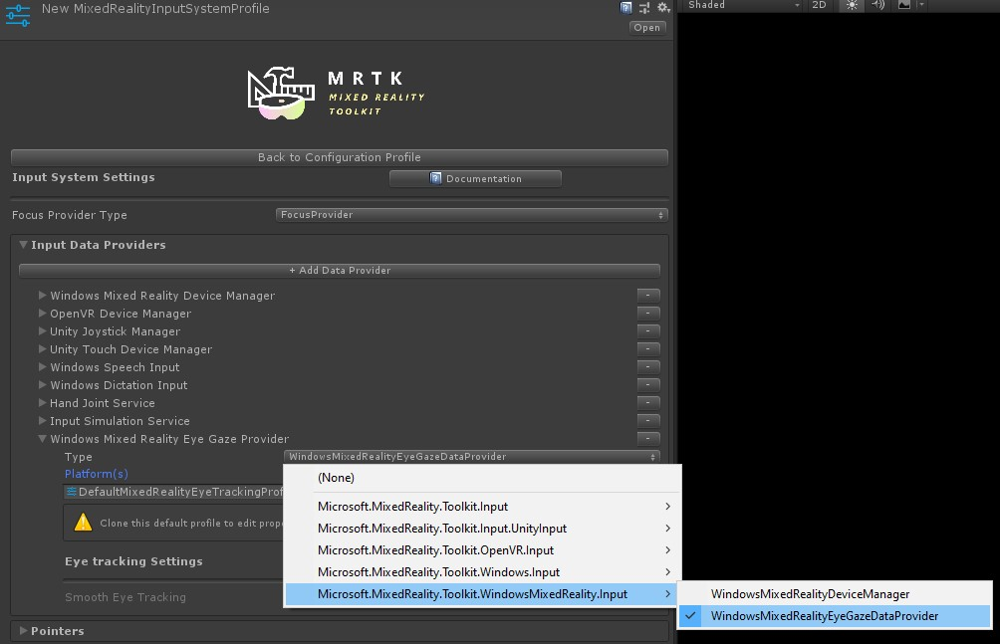

# Getting started with eye tracking in MRTK

This page covers how to set up your Unity MRTK scene to use eye tracking in your app.
The following assumes you are starting out with a fresh new scene.
Alternatively, you can check out our already configured [MRTK eye tracking examples](eye-tracking-examples-overview.md) with tons of great examples that you can directly build on.

## Eye tracking requirements checklist

For eye tracking to work correctly, the following requirements must be met.
If you are new to eye tracking on HoloLens 2 and to how eye tracking is set up in MRTK, don't worry!
We will go into detail on how to address each of them further below.

1. An _'Eye Gaze Data Provider'_ must be added to the input system. This provides eye tracking data from the platform.
2. The _'GazeInput'_ capability must be enabled in the application manifest.
   **This capability can be set in Unity 2019, but in Unity 2018 and earlier this capability is only available in Visual Studio and through the MRTK build tool**
3. The HoloLens **must** be eye calibrated for the current user. Check out our [sample for detecting whether a user is eye calibrated or not](eye-tracking-is-user-calibrated.md).

### A note on the GazeInput capability

The MRTK-provided build tooling (i.e. Mixed Reality Toolkit -> Utilities -> Build Window)
can automatically enable the GazeInput capability for you. In order to do this,
you need to make sure that the 'Gaze Input Capability' is checked on the 'Appx Build Options' tab:

This tooling will find the AppX manifest after the Unity build is completed and manually add the GazeInput capability.
**Prior to Unity 2019, this tooling is NOT active when using Unity's built-in Build Window** (i.e. File -> Build Settings).

Prior to Unity 2019, when using Unity's build window, the capability will need to be manually added after the Unity build, as follows:

1. Open your compiled Visual Studio project and then open the _'Package.appxmanifest'_ in your solution.
2. Make sure to tick the _'GazeInput'_ checkbox under _Capabilities_. If you don't see a _'GazeInput'_ capability, check that your system meets the [prerequisites for using MRTK](../../install-the-tools.md#prerequisites) (in particular the Windows SDK version).

_Please note:_
You only have to do this if you build into a new build folder.
This means that if you had already built your Unity project and set up the appxmanifest before and now target the same folder again, you will not need to reapply your changes.

## Setting up eye tracking step-by-step

### Setting up the scene

Set up the _MixedRealityToolkit_ by simply clicking _'Mixed Reality Toolkit -> Configure…'_ in the menu bar.

### Setting up the MRTK profiles required for eye tracking

After setting up your MRTK scene, you will be asked to choose a profile for MRTK.
You can simply select _DefaultMixedRealityToolkitConfigurationProfile_ and then select the _'Copy & Customize'_ option.

### Create an "eye gaze data provider"

- Click on the _'Input'_ tab in your MRTK profile.
- To edit the default one ( _'DefaultMixedRealityInputSystemProfile'_ ), click the _'Clone'_ button next to it. A _'Clone Profile'_ menu appears. Simply click on _'Clone'_ at the bottom of that menu.
- Double click on your new input profile, expand _'Input Data Providers'_, and select _'+ Add Data Provider'_.
- Create a new data provider:
  - Under **Type** select _'Microsoft.MixedReality.Toolkit.WindowsMixedReality.Input'_ -> _'WindowsMixedRealityEyeGazeDataProvider'_
  - For **Platform(s)** select _'Windows Universal'_.

### Simulating eye tracking in the Unity Editor

You can simulate eye tracking input in the Unity Editor to ensure that events are correctly triggered before deploying the app to your HoloLens 2.
The eye gaze signal is simulated by simply using the camera's location as eye gaze origin and the camera's forward vector as eye gaze direction.
While this is great for initial testing, please note that it is not a good imitation for rapid eye movements.
For this, it is better to ensure frequent tests of your eye-based interactions on the HoloLens 2.

1. **Enable simulated eye tracking**:
    - Click on the _'Input'_ tab in your MRTK configuration profile.
    - From there, navigate to _'Input Data Providers'_ -> _'Input Simulation Service'_.
    - Clone the _'DefaultMixedRealityInputSimpulationProfile'_ to make changes to it.
    - Check the _'Simulate Eye Position'_ checkbox.

    

2. **Disable default head gaze cursor**:
In general, it is recommended to avoid showing an eye gaze cursor or if absolutely required to make it _very_ subtle.
We do recommend to hide the default head gaze cursor that is attached to the MRTK gaze pointer profile by default.
    - Navigate to your MRTK configuration profile -> _'Input'_ -> _'Pointers'_
    - Clone the _'DefaultMixedRealityInputPointerProfile'_ to make changes to it.
    - At the top of the _'Pointer Settings'_, you should assign an invisible cursor prefab to the _'GazeCursor'_. You can do this by selecting the _'EyeGazeCursor'_ prefab from the MRTK Foundation.

### Enabling eye-based gaze in the gaze provider

In HoloLens v1, head gaze was used as primary pointing technique.
While head gaze is still available via the _GazeProvider_ in MRTK which is attached to your [Camera](https://docs.unity3d.com/ScriptReference/Camera.html), you can check to use eye gaze instead by ticking the _'IsEyeTrackingEnabled'_ checkbox in the gaze settings of the input pointer profile.

>[!NOTE]
>Developers can toggle between eye-based gaze and head-based gaze in code by changing the _'IsEyeTrackingEnabled'_ property of _'GazeProvider'_.  

>[!IMPORTANT]
>If any of the eye tracking requirements are not met, the application will automatically fall back to head-based gaze.

### Accessing eye gaze data

Now that your scene is set up to use eye tracking, let's take a look at how to access it in your scripts:
[Accessing eye tracking data via EyeGazeProvider](eye-tracking-eye-gaze-provider.md) and [eye-supported target selections](eye-tracking-target-selection.md).

### Testing your Unity app on a HoloLens 2

Building your app with eye tracking should be similar to how you would compile other HoloLens 2 MRTK apps. Be sure that you have enabled the *'Gaze Input'* capability as described above in the section [*A note on the GazeInput capability*](#a-note-on-the-gazeinput-capability).

#### Eye calibration

Finally, please don't forget to run through the eye calibration on your HoloLens 2.
The eye tracking system will not return any input if the user is not calibrated.
Easiest way to get to the calibration is by flipping up the visor and back down.
A system notification should appear welcoming you as a new user and asking you to go through the eye calibration.
Alternatively you can find the eye calibration in the system settings: Settings > System > Calibration > Run eye calibration.

#### Eye tracking permission

When starting the app on your HoloLens 2 for the first time, a prompt should pop up asking the user for permission to use eye tracking.
If it is not showing up, then that is usually an indication that the _'GazeInput'_ capability was not set.

After the permission prompt showed up once, it will not show up automatically again.
If you _"denied eye tracking permission"_, you can reset this in Settings -> Privacy -> Apps.

---

This should get you started with using eye tracking in your MRTK Unity app.
Don't forget to check out [our MRTK eye tracking tutorials and samples](eye-tracking-examples-overview.md) demonstrating how to use eye tracking input and conveniently providing scripts that you can reuse in your projects.

---
[Back to "Eye tracking in the MixedRealityToolkit"](eye-tracking-main.md)
