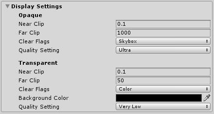

# Camera system

The camera system enables the Microsoft Mixed Reality Toolkit to configure and optimize the application's camera for use in mixed reality applications. Using the camera system, applications can be written to support both opaque (ex: virtual reality) and transparent (ex: Microsoft HoloLens) devices without needing to write code to distinguish between, and accommodate for, each type of display.

## Enabling the camera system

The Camera System is managed by the MixedRealityToolkit object (or another service registrar component).

The following steps presume use of the MixedRealityToolkit object. Steps required for other service registrars may be different.

1. Select the MixedRealityToolkit object in the scene hierarchy.

    

2. Navigate the Inspector panel to the camera system section and ensure that **Enable Camera System** is checked.

    

3. Select the camera system implementation. The default class implementation provided by the MRTK is the `MixedRealityCameraSystem`.

    

4. Select the desired configuration profile

    

## Configuring the camera system

### Settings providers

Camera setting providers enable platform specific configuration of the camera. These settings may include custom configuration steps and/or components.

Providers can be added by clicking the **Add Camera Settings Provider** button. They can be removed by clicking the **-** button to the right of the provider's name.

> [!Note]
> Not all platforms will require a camera settings provider. If there are no providers that are compatible with the platform on which the application is running, the Microsoft Mixed Reality Toolkit will apply basic defaults.

### Display settings

Display settings are specified for both opaque (ex: Virtual Reality) and transparent (ex: Microsoft HoloLens) displays. The camera is configured, at run time, using these settings.

**Near Clip**

The near clip plane is the closest, in meters, that a virtual object can be to the camera and still be rendered. For greatest user comfort, it is recommended to make this value greater than zero. The previous image contains values that have been found to be comfortable on a variety of devices.

**Far Clip**

The far clip plane is the furthest, in meters, that a virtual object can be to the camera and still be rendered. For transparent devices, it is recommended that this value be relatively close as not to overly exceed the real world space and break the application's immersive qualities.

**Clear Flags**

The clear flags value indicates how the display is cleared as it is drawn. For virtual reality experiences, this value is most often set to Skybox. For transparent displays, it is recommended to set this to Color.

**Background Color**

If the clear flags are not set to Skybox, the background color property will be displayed.

**Quality Settings**

The quality settings value indicates the graphics quality that Unity should use when it renders the scene. The quality level is a project level setting and is not specific to any one camera. For more information, please see the [Quality](https://docs.unity3d.com/Manual/class-QualitySettings.html) article in Unity's documentation.

## See also

- [Camera System API Documentation](xref:Microsoft.MixedReality.Toolkit.CameraSystem)
- [Creating a Camera Settings Provider](create-settings-provider.md)
