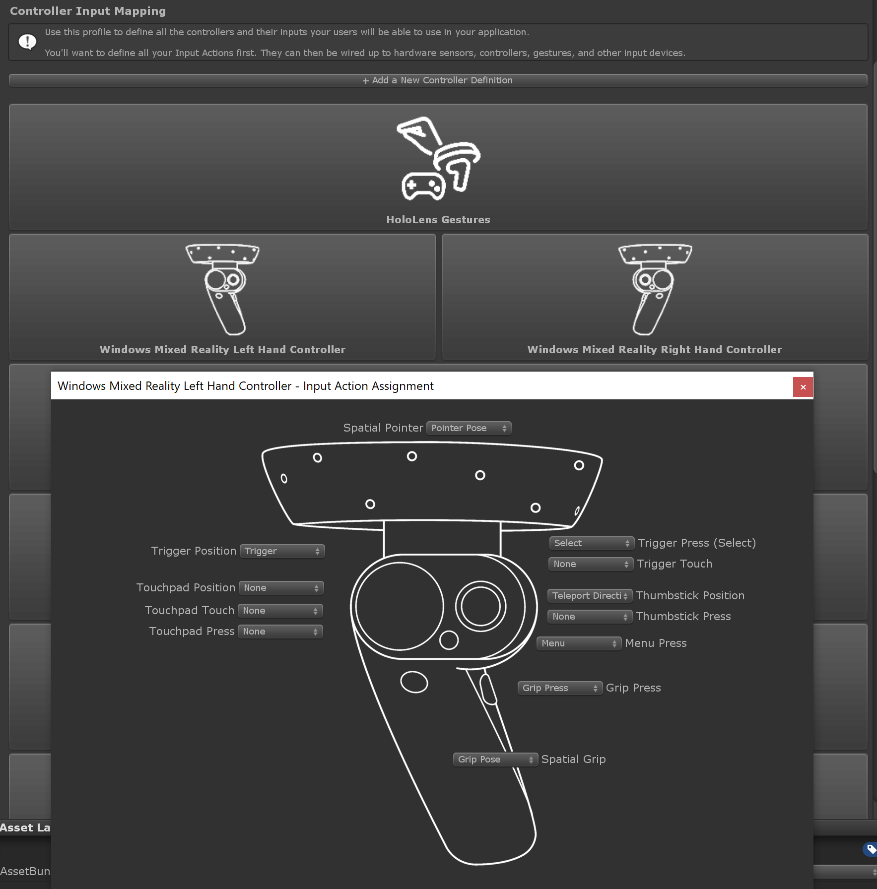

# Controllers

Controllers are created and destroyed automatically by [**input providers**](input-providers.md). Each controller type has a number of *physical inputs* defined by an *axis type*, telling us the data type of the input value (Digital, Single Axis, Dual Axis, Six Dof, ...), and an *input type* (Button Press, Trigger, Thumb Stick, Spatial Pointer, ...) describing the origin of the input. Physical inputs are mapped to *input actions* via in the **Controller Input Mapping Profile**, under the *Input System Profile* in the Mixed Reality Toolkit component.

MRTK will automatically detect WMR controllers and display them when the [**Microsoft.MixedReality.Input**](/windows/mixed-reality/develop/unity/unity-reverb-g2-controllers#installing-microsoftmixedrealityinput-with-the-mixed-reality-feature-tool) package is installed. Controllers models will only show up in the editor when using the OpenXR pipeline. To visualize Oculus controller models, follow the [Oculus Quest deployment instructions](/windows/mixed-reality/mrtk-unity/supported-devices/oculus-quest-mrtk)

