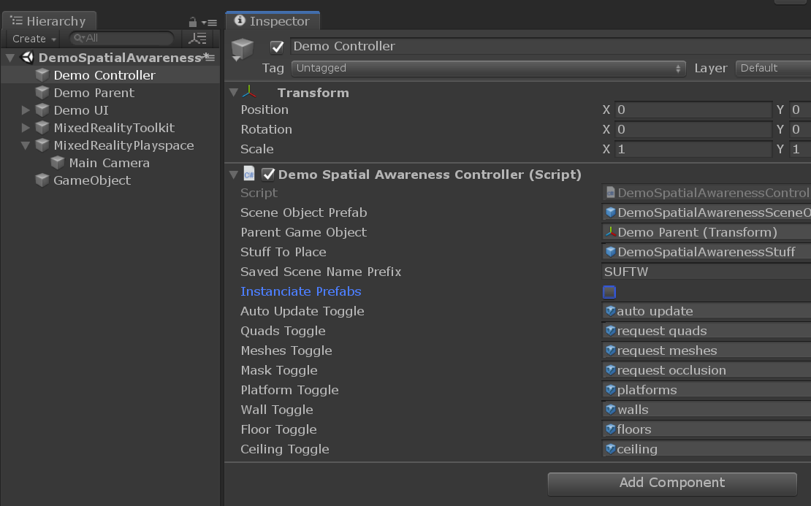

# Scene Understanding

[Scene Understanding](/windows/mixed-reality/scene-understanding) returns a semantic representation of scene entities as well as their geometric forms on __HoloLens 2__ (HoloLens 1st Gen is not supported).

Some expected use cases of this technology are:
* Place objects on nearest surface of a certain kind (e.g. wall and floor)
* Construct nav-mesh for platform style games
* Provide physics engine friendly geometry as quads
* Accelerate development by avoiding the need to write similar algorithms

Scene Understanding is available as an __experimental__ feature starting from MRTK 2.6. It is integrated into MRTK as a [spatial observer](spatial-awareness-getting-started.md#register-observers) called [`WindowsSceneUnderstandingObserver`](xref:Microsoft.MixedReality.Toolkit.WindowsSceneUnderstanding.Experimental.WindowsSceneUnderstandingObserver). Scene Understanding works both with the Legacy XR pipeline and the XR SDK pipeline. In both cases the `WindowsSceneUnderstandingObserver` is used.

## Observer overview

When asked, the [`WindowsSceneUnderstandingObserver`](xref:Microsoft.MixedReality.Toolkit.WindowsSceneUnderstanding.Experimental.WindowsSceneUnderstandingObserver) will return [SpatialAwarenessSceneObject](xref:Microsoft.MixedReality.Toolkit.Experimental.SpatialAwareness.SpatialAwarenessSceneObject) with attributes useful for the application to understand its surroundings. The observation frequency, returned object type (e.g. wall, floor) and other observer behaviors are dependent on the configuration of the observer via profile. For instance, if the occlusion mask is desired the observer must be configured to generate quads. The observed scene can be saved as serialized file that can be later loaded to recreate the scene in editor play mode.

## Setup

> [!IMPORTANT]
> Scene Understanding is only supported on HoloLens 2 and Unity 2019.4 and higher.

1. Ensure the platform is set to UWP in build settings.
1. Acquire the Scene Understanding package via [Mixed Reality Feature Tool](https://aka.ms/MRFeatureTool).

## Using Scene Understanding

The quickest way to get started with Scene Understanding is to check out the sample scene.

### Scene Understanding sample scene

In Unity, use the Project Explorer to open the scene file in `Examples/Experimental/SceneUnderstanding/Scenes/SceneUnderstandingExample.unity` and press play!

> [!IMPORTANT]
> When using the Mixed Reality Feature Tool or otherwise importing via UPM, please import the Demos - SpatialAwareness sample before importing the Experimental - SceneUnderstanding sample due to a dependency issue. Please see [this GitHub issue](https://github.com/microsoft/MixedRealityToolkit-Unity/issues/9431) for more information.

The scene demonstrates the following:

* Visualization of observed Scene Objects with in application UI for configuring the observer
* Example `DemoSceneUnderstandingController` script that shows how to change observer settings and listen to relevant events
* Saving scene data to device for offline development
* Loading previously saved scene data (.bytes files) to support in-editor development workflow

> [!NOTE] 
> The sample scene is based on the Legacy XR pipeline. If you are using the XR SDK pipeline you should modify the profiles accordingly. The provided Scene Understanding Spatial Awareness System profile (`DemoSceneUnderstandingSystemProfile`) and the Scene Understanding Observer profiles (`DefaultSceneUnderstandingObserverProfile` and `DemoSceneUnderstandingObserverProfile`) works for both pipelines.

#### Configuring the observer service

Select the 'MixedRealityToolkit' game object and check the inspector.

These options will allow one to configure the `WindowsSceneUnderstandingObserver`.

### Example script

The example script _DemoSceneUnderstandingController.cs_ demonstrates the major concepts in working with the Scene Understanding service.

* Subscribing to Scene Understanding events
* Handling Scene Understanding events
* Configuring the `WindowsSceneUnderstandingObserver` at runtime

The toggles on the panel in the scene change the behavior of scene understanding observer by calling public functions of this sample script.

Turning on *Instantiate Prefabs*, will demonstrate creating objects that size to fit themselves to all [SpatialAwarenessSceneObject](xref:Microsoft.MixedReality.Toolkit.Experimental.SpatialAwareness.SpatialAwarenessSceneObject), gathered neatly under a parent object.

### Built app notes

Build and deploy to HoloLens in the standard way. Once running, a number of buttons should appear to play with the features.

Note, their are some pit falls in making queries to the observer. Misconfiguration of a fetch request result in your event payload not containing the expected data. For example, if one doesn't request quads, then no occlusion mask textures will be present. Like wise, no world mesh will appear if the observer is not configured to request meshes. The `DemoSceneUnderstandingController` script takes care of some of these dependencies, but not all.

Saved scene files can be accessed through the [device portal](/windows/mixed-reality/using-the-windows-device-portal) at `User Folders/LocalAppData/[APP_NAME]/LocalState/PREFIX_yyyyMMdd_hhmmss.bytes`. These scene files can be used in editor by specifying them in the observer profile found in the inspector.

## See Also

* https://docs.microsoft.com/windows/mixed-reality/scene-understanding
* https://docs.microsoft.com/windows/mixed-reality/scene-understanding-sdk