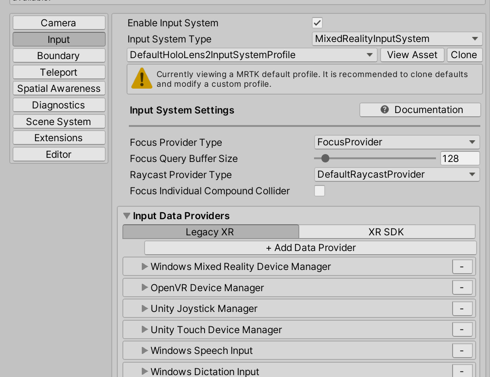

# Microsoft Mixed Reality Toolkit vNext Release Notes

## What's new in vNext

### Legacy XR and XR SDK Data Providers can now be used within the same profile

Data providers will now also only be loaded when the appropriate pipeline is selected, allowing both Legacy XR and XRSDK data providers to co-exist within 
the same profile. To accomdate this, Legacy XR and XR SDK Data Providers are now organized under different tabs within the profile view, helping users 
determine whether they have the correct profile for their targetted XR pipeline.



To accommodate this null data providers will now no longer be loaded and displayed in the profile inspector. Users can toggle `Show null data providers in the profile inspector`
under **Edit -> Project Settings -> Mixed Reality Toolkit** to debug unexpected behaviors with missing data providers.


### Added Experience Settings and an associated Mixed Reality Scene Content behavior

Users can now configure [Experience Settings](../features/experience-settings/experience-settings.md), which will allow MRTK to display [Mixed Reality Scene Content](../features/experience-settings/scene-content.md)
appropriately based on the targeted experience.

If user's previous Experience Scale settings do not match the new Experience Settings Profile, they will be prompted to correct it in the inspector


### Teleport Hotspot added

A new teleport hotspot component has been graduated. You can add a teleport hotspot to your gameobject to ensure that the user is in a certain position and orientation when they teleport to that location.


### Added support for Leap Motion Unity Modules version 4.6.0, 4.7.0, 4.7.1 and 4.8.0

Support for the latest versions of the [Leap Motion Unity Modules](https://developer.leapmotion.com/unity) is now compatible with MRTK 2.7.0.  See [How to Configure MRTK for Leap Motion](../features/cross-platform/leap-motion-mrtk.md) for more information. 


## Known Issues

### Text Mesh Pro Canvas Renderer warnings in Unity 2020

The following warning is logged in most MRTK example scenes while using Unity 2020:

```
Please remove the CanvasRenderer component from the [TextMeshPro] GameObject as this component is no longer necessary.
```

The Canvas Renderer warning was added in [TextMeshPro version 3.0.3](https://docs.unity3d.com/Packages/com.unity.textmeshpro@3.0/changelog/CHANGELOG.html#changes-3).  These warning do not have an impact on MRTK's example scenes and can be cleared from the console. See [Issue 9811](https://github.com/microsoft/MixedRealityToolkit-Unity/issues/9811) for more details. 
